# Teste de resolução de problemas

Este repositório tem como objetivo apresentar algumas soluções para problemas de níveis médio e difícil encontrados na plataforma [edabit](https://edabit.com/challenges).

### John Charles Mello

 [LinkedIn](https://www.linkedin.com/in/johncmello/)

> Desafios

- - - -
## Nível Médio
- - - -

- [How Much is True?](https://edabit.com/challenge/GLbuMfTtDWwDv2F73)
  
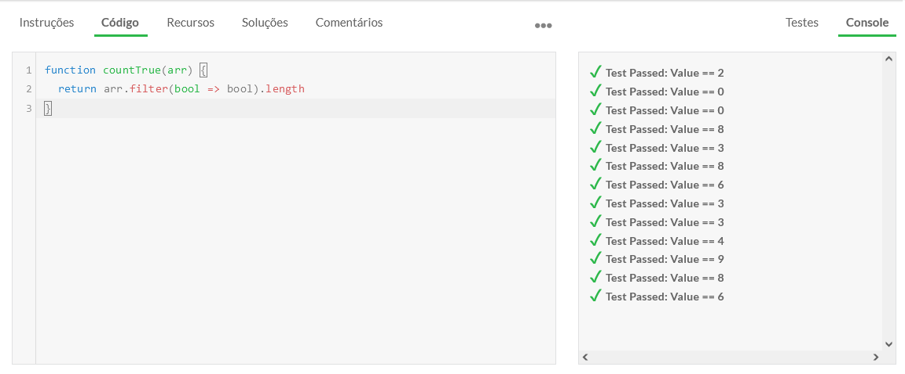
  
- [Tile Teamwork Tactics](https://edabit.com/challenge/NHfYRHg2tDtcZyykB)

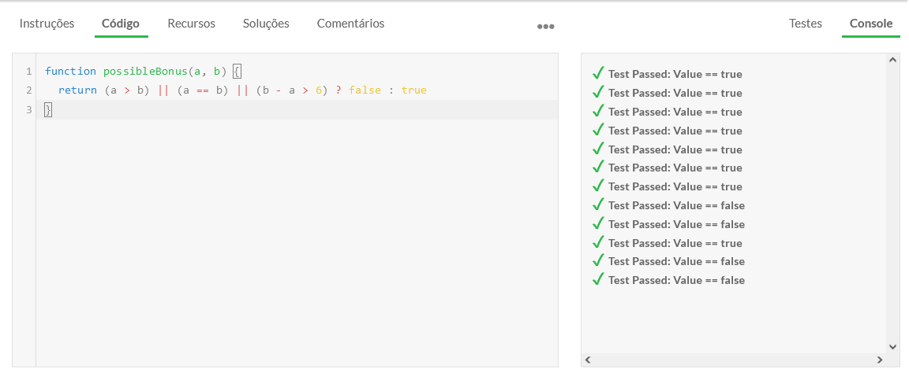
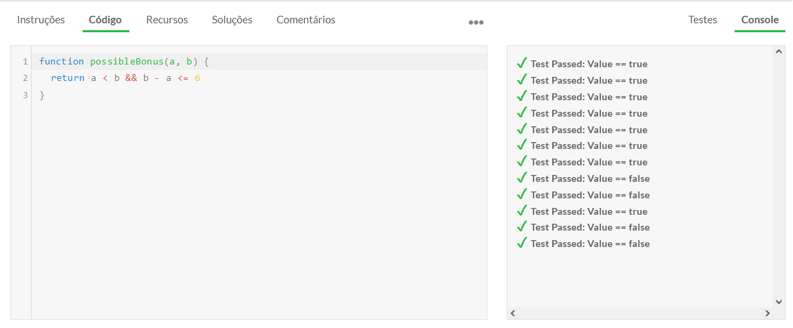

- [Right Shift by Division](https://edabit.com/challenge/ALGbgMWLuEdrh22fB)

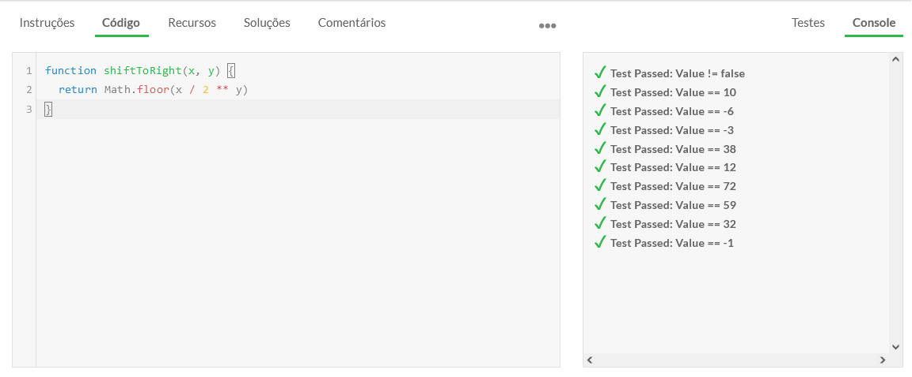

- [Perimeters with a Catch](https://edabit.com/challenge/WEvqZTFcHeYzFn74c)

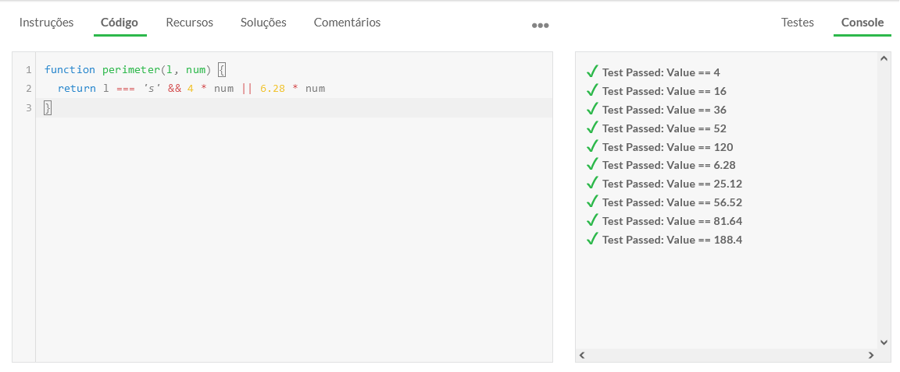

- [Find Number of Digits in Number](https://edabit.com/challenge/yFJzLfYghz7ZtsyAN)

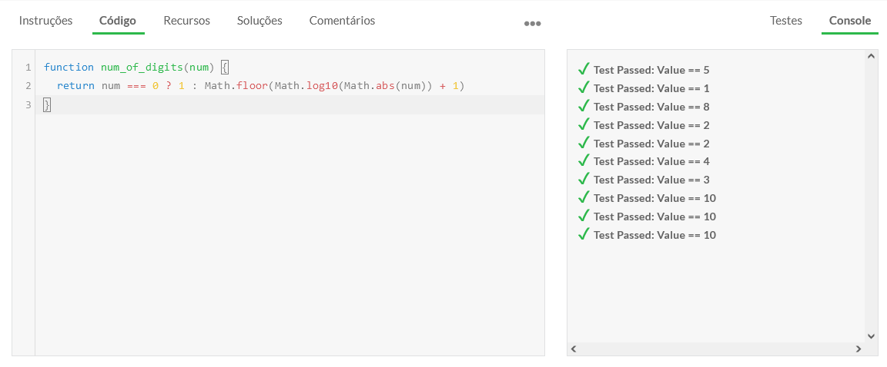

- [Burglary Series (04): Add its Name](https://edabit.com/challenge/9KEKJG5PZTFmG3Zau)

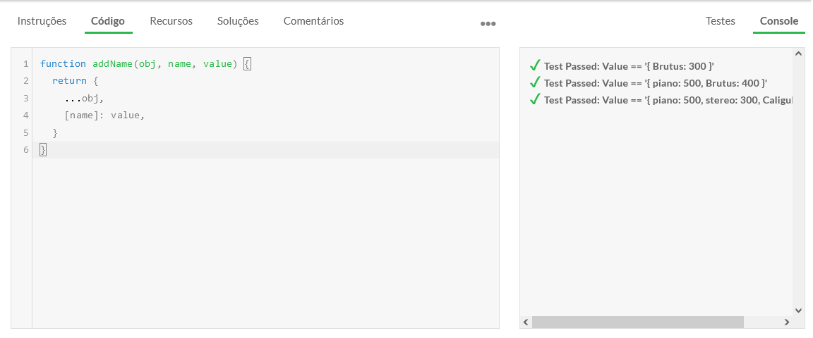

- [Which Generation Are You?](https://edabit.com/challenge/48EJWLhF224na8po3)

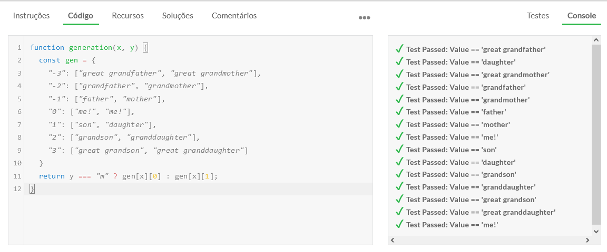

- - - -
## Nível Dificil
- - - -

- [Seven Boom!](https://edabit.com/challenge/6R6gReGTGwzpwuffD)
  
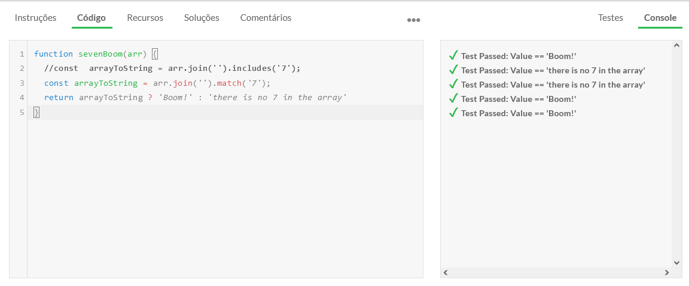

- [Tower of Hanoi](https://edabit.com/challenge/3ZtykTsx3GSoPHyBb)

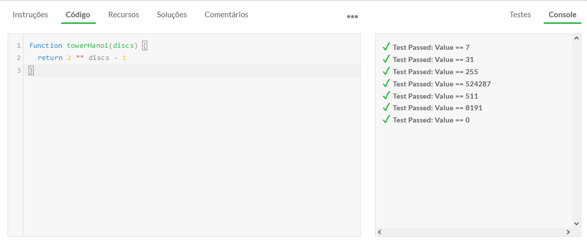

- [Number of Boomerangs](https://edabit.com/challenge/b7iHQDw72zzkmgCun)

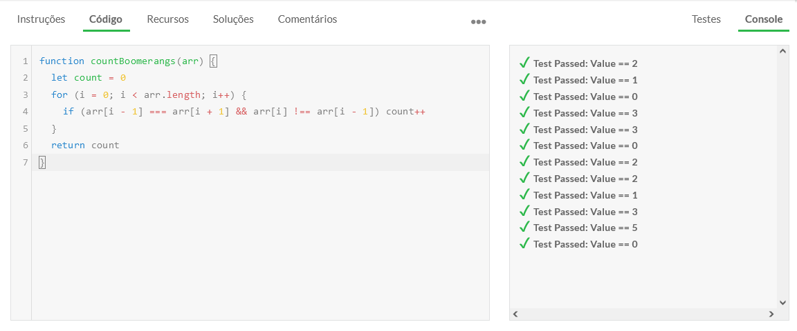

- [Oddish vs. Evenish](https://edabit.com/challenge/r6TSNwkLZ2DgsoKiH)

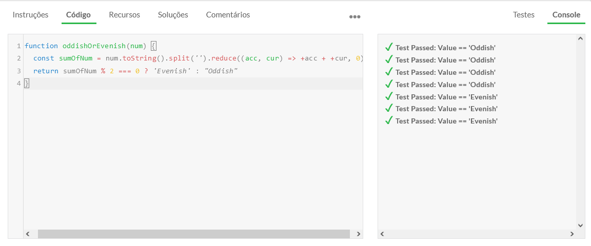

- - - -

Eu gostaria de ter feito concluido outros desafios, mas o acesso gratuito só permite um número limitado de resoluções. :smile: